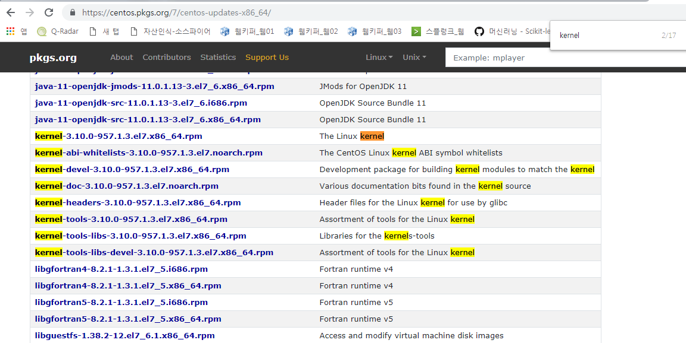
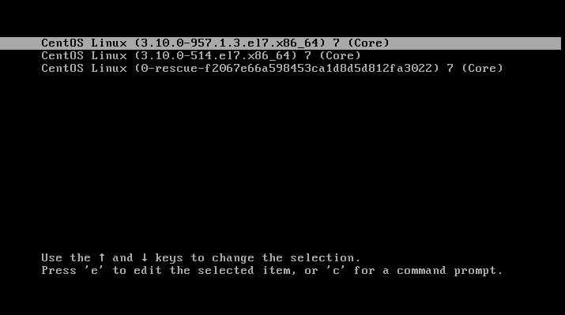

# Linux Basic 


## booting Process

- disk blocksize
```blockdev --getbsz /dev/sda
4096 
```
> 위 결과는 Disk의 Block 사이즈 단위 가 4K라는 것을 알 수 있다.

```
[root@clu_1 docker]# echo "test" > test.txt
[root@clu_1 docker]# du -h test
4.0K    test
```
> 위의 결과를 살펴 보면, 가장 단순한 파일 하나도 4 Kbyte가 할당 되어 있음을 알 수 있다. 즉, Disk에서 가장 작은 단위는 4 Kbyte 임을 확인 할 수 있다. 


## MBR


## bash


## docker : chroot / cgroups / namespace

> chroot


## env
> env
> env | grep PATH
> whereis ls
- PATH에는 우선 순위가 있다. 로컬 디렉터리에 동일한 **ls** 명령어가 있다고 하더라도, PATH 환경변수의 우선순위가에 따라 실행한다. 즉, **ls**와 **./ls**는 다르다.
```bash
[root@clu_1 tmp]# env | grep PATH
PATH=/usr/local/sbin:/usr/local/bin:/usr/sbin:/usr/bin:/root/bin
```
- 환경변수에 매번 추가하기 위해서는, **.bash_profile** 도는 **.bashrc**를 통해서 설정할 수 있다. 


## chage
- 사용자 계정의 기간 만료를 설정한다. 
> chage -l root


## su / sudo 
- su : switch user
- sudo : root와 동일한 권한으로 실행한다. 

```bash
[root@clu_1 docker]# ll /etc/sudoers  
```

```bash
[root@clu_1 docker]# ll /etc/sudoers
-r--r-----. 1 root root 3907 Nov  5  2016 /etc/sudoers

```


## Permission 
- setuid, setguid
- sticky 권한 (t)

```bash
[root@clu_1 docker]# 
drwxrwxrwt.  23 root root  4096 Dec 19 11:11 tmp
```


# Network


## netstat

## ss ( CentOS 7 부터 기본 사용)
- ss 명령어가 좀 더 최적화 되어 있다. 좀 더 빠르다. 


## Bonding 

- 물리적인 다수개의 NIC카드를 하나로 묶어서 논리적인 NIC 카드 1개로 인식
> network Interface 이중화이며, Windows는 티밍과 동일하다. 

- Bonding은 총 7개의 mode를 가지고 있다. 


- network device 정보를 확인한다. (bonding을 구성한 네트워크 정보를 확인한다.)
```bash
$ cat /proc/net/dev
[root@clu_2 ~]# cat /proc/net/dev
Inter-|   Receive                                                |  Transmit
 face |bytes    packets errs drop fifo frame compressed multicast|bytes    packets errs drop fifo colls carrier compressed
enp0s3:   16114     119    0    0    0     0          0         0    29953     224    0    0    0     0       0          0
enp0s8:    3416      22    0    0    0     0          0         0        0       0    0    0    0     0       0          0
 bond0:       0       0    0    0    0     0          0         0        0       0    0    0    0     0       0          0
    lo:  208634    2050    0    0    0     0          0         0   208634    2050    0    0    0     0       0          0
```

- `vi /etc/modprobe.d/bonding.conf` 에서 본딩 설정을 한다. 
```bash
[root@clu_1 bin]# cat /etc/modprobe.d/bonding.conf
alias bond0 bonding
```
> 여기에서는, boding 할 대상을 enp0s3, enp0s8로 가정한다.
> modprobe는 과거의 insmod/rmmod를 대신한다. bond의 kernel moduel은 kernel driver에 이미 탑재되어 있다.(아래 참조) 
위 bonding.conf는 bodning module이 적재될 때 자동 실행되는 conf를 설정한다. 여기서는 bonding이라는 이름 대신 bond0로 대신하도록 alias하였다. 

```bash
[root@clu_2 ~]# ls /usr/lib/modules/3.10.0-514.el7.x86_64/kernel/drivers/net/bonding/
bonding.ko

```


- Bonding 구성 후 
```bash
[root@clu_2 ~]# cat /proc/net/dev
Inter-|   Receive                                                |  Transmit
 face |bytes    packets errs drop fifo frame compressed multicast|bytes    packets errs drop fifo colls carrier compressed
enp0s3:  406104    1482    0    0    0     0          0        26 18887829   56721    0    0    0     0       0          0
enp0s8:   80442    1157    0    0    0     0          0        17     8125      50    0    0    0     0       0          0
 **bond0:    3382      25    0    0    0     0          0         2     4053      21    0    0    0     0       0          0 **
    lo: 5874918   19624    0    0    0     0          0         0  5874918   19624    0    0    0     0       0          0
[root@clu_2 ~]# 
[root@clu_2 ~]# ifconfig
bond0: flags=5187<UP,BROADCAST,RUNNING,MASTER,MULTICAST>  mtu 1500
        inet 192.168.56.102  netmask 255.255.255.0  broadcast 192.168.56.255
        inet6 fe80::a00:27ff:fe87:b86  prefixlen 64  scopeid 0x20<link>
        ether 08:00:27:87:0b:86  txqueuelen 1000  (Ethernet)
        RX packets 59  bytes 6284 (6.1 KiB)
        RX errors 0  dropped 0  overruns 0  frame 0
        TX packets 21  bytes 4053 (3.9 KiB)
        TX errors 0  dropped 0 overruns 0  carrier 0  collisions 0

```
> `[root@clu_2 ~]# ifdown enp0s3` 을 사용하여 enp0s3를 다운시켜도, Network는 동작하는 것을 확인 할 수 있다. 

```bash
[root@clu_2 ~]# ifdown enp0s3
[root@clu_2 ~]# ifconfig
bond0: flags=5187<UP,BROADCAST,RUNNING,MASTER,MULTICAST>  mtu 1500
        inet 192.168.56.102  netmask 255.255.255.0  broadcast 192.168.56.255
        inet6 fe80::a00:27ff:fe87:b86  prefixlen 64  scopeid 0x20<link>
        ether 08:00:27:87:0b:86  txqueuelen 1000  (Ethernet)
        RX packets 119  bytes 11582 (11.3 KiB)
        RX errors 0  dropped 0  overruns 0  frame 0
        TX packets 42  bytes 6469 (6.3 KiB)
        TX errors 0  dropped 0 overruns 0  carrier 0  collisions 0

enp0s8: flags=6211<UP,BROADCAST,RUNNING,SLAVE,MULTICAST>  mtu 1500
        ether 08:00:27:87:0b:86  txqueuelen 1000  (Ethernet)
        RX packets 1251  bytes 88642 (86.5 KiB)
        RX errors 0  dropped 0  overruns 0  frame 0
        TX packets 71  bytes 10541 (10.2 KiB)
        TX errors 0  dropped 0 overruns 0  carrier 0  collisions 0

lo: flags=73<UP,LOOPBACK,RUNNING>  mtu 65536
        inet 127.0.0.1  netmask 255.0.0.0
        inet6 ::1  prefixlen 128  scopeid 0x10<host>
        loop  txqueuelen 1  (Local Loopback)
        RX packets 19630  bytes 5875446 (5.6 MiB)
        RX errors 0  dropped 0  overruns 0  frame 0
        TX packets 19630  bytes 5875446 (5.6 MiB)
        TX errors 0  dropped 0 overruns 0  carrier 0  collisions 0
```


# logs

## journal
 - CentOS 7 부터 로그시스템이 journal 을 통해서 분배되는 아키텍처로 바뀌었다. 
 > CentOS 7 이전은 init.d가 모체 였으나, 버전 7부터 **systemd**가 프로세스의 모체로 바뀌었다. 

- journalctl
  : journalctl -r 옵션 : 뒤에서 부터 볼 수 있다. 
- /var/log/messages : info에 해당하는 로그만
- /var/log/dmesg  ==> `journalctl -k`와 동일

## logrotate
- Log 저장 설정
- 설정 파일 : /etc/logrotate.conf
```bash
[root@clu_1 docker]# cat /etc/logrotate.conf
# see "man logrotate" for details
# rotate log files weekly
weekly

# keep 4 weeks worth of backlogs
rotate 4

# create new (empty) log files after rotating old ones
create

# use date as a suffix of the rotated file
dateext

# uncomment this if you want your log files compressed
#compress

# RPM packages drop log rotation information into this directory
include /etc/logrotate.d

# no packages own wtmp and btmp -- we'll rotate them here
/var/log/wtmp {
    monthly
    create 0664 root utmp
        minsize 1M
    rotate 1
}

/var/log/btmp {
    missingok
    monthly
    create 0600 root utmp
    rotate 1
}

# system-specific logs may be also be configured here.
```


# rsyslog
> 설정파일은 **/etc/rsyslog.conf**


## Client Side
- 설정파일 변경 : remote server로 로그를 전송하도록 설정
- udp 514
- 보내는 로그의 종료 선택 : info/none 등

```bash
[root@clu_1 docker]# cat /etc/rsyslog.conf | grep @192
*.info;mail.none;authpriv.none;cron.none                @192.168.56.102
```
> remote log server의 IP가 192.168.56.102라고 가정한다. (clu_2)

## Server Side
- remote에서 받아오는 서버를 특정 위치에 저장하도록 설정
- udp 514

```bash
[root@clu_2 clu_1]# cat /etc/rsyslog.conf | grep "template\|UDP" -2
# Provides UDP syslog reception
$ModLoad imudp
$UDPServerRun 514

$template FILENAME, "/var/log/remote/%hostname%/message_%$YEAR%%$MONTH%%$DAY%.log"
*.info;mail.none;authpriv.none;cron.none                ?FILENAME
```
> grep에서 여러개의 구문을 찾기위해서, "단어1\|단어2\|..." 형태로 입력할 수 있다. 
> grep 의 -2 옵션은 조건매칭된 행을 기준으로 +/- 2개행을 함께 출력하라는 의미 이다. 


# LVM (Logical Volume Manager)

물리적인 디스크들을 하나의 논리 디스크로 관리하는 기능이다. 아래와 같은 장점과 기능 지원 사항이 있다.
- 서로 다른 디바이스 조합 지원
- 확장성
- 직관적인 저장장치로의 접근
- 편리한 관리
- 안정성 및 효율성, 스냅샷 지원 등

> LVM1에서 LVM2로 업데이트되었다. 보다 효율적인 메타데이터 스토리지를 관리 한다.

## PV (Physical Volume)
- HDD를 등록하면 잡히는 물리 볼륨으로 Linux에서는 **/dev/sda1**, **/dev/sda2**와 같은 명칭으로 표기된다.

## VG( Volume Group )


## LVM 설정하기 

```bash
[root@clu_1 ~]# fdisk -l | grep Disk.*byte
Disk /dev/sda: 12.9 GB, 12884901888 bytes, 25165824 sectors
Disk /dev/sdb: 1073 MB, 1073741824 bytes, 2097152 sectors
Disk /dev/sdc: 1073 MB, 1073741824 bytes, 2097152 sectors
Disk /dev/sdd: 1073 MB, 1073741824 bytes, 2097152 sectors
Disk /dev/mapper/cl-root: 10.7 GB, 10733223936 bytes, 20963328 sectors
Disk /dev/mapper/cl-swap: 1069 MB, 1069547520 bytes, 2088960 sectors
Disk /dev/mapper/VG01-note8: 20 MB, 20971520 bytes, 40960 sectors
```


```bash
[root@clu_1 ~]# pvcreate /dev/sdc1
  Physical volume "/dev/sdc1" successfully created.
[root@clu_1 ~]# pvcreate /dev/sdd1
  Physical volume "/dev/sdd1" successfully created.
[root@clu_1 ~]# pvs
  PV         VG   Fmt  Attr PSize    PFree
  /dev/sda2  cl   lvm2 a--    11.00g    4.00m
  /dev/sdb1  VG01 lvm2 a--  1020.00m 1000.00m
  /dev/sdc1       lvm2 ---  1023.00m 1023.00m
  /dev/sdd1       lvm2 ---  1023.00m 1023.00m
[root@clu_1 ~]# lsblk
NAME           MAJ:MIN RM  SIZE RO TYPE MOUNTPOINT
sda              8:0    0   12G  0 disk
├─sda1           8:1    0    1G  0 part /boot
└─sda2           8:2    0   11G  0 part
  ├─cl-root    253:0    0   10G  0 lvm  /
  └─cl-swap    253:1    0 1020M  0 lvm  [SWAP]
sdb              8:16   0    1G  0 disk
└─sdb1           8:17   0 1023M  0 part
  └─VG01-note8 253:2    0   20M  0 lvm
sdc              8:32   0    1G  0 disk
└─sdc1           8:33   0 1023M  0 part
sdd              8:48   0    1G  0 disk
└─sdd1           8:49   0 1023M  0 part
sr0             11:0    1 1024M  0 rom

[root@clu_1 ~]# vgcreate VG2 /dev/sdc1 /dev/sdd1
  Volume group "VG2" successfully created
[root@clu_1 ~]# vgs
  VG   #PV #LV #SN Attr   VSize    VFree
  VG01   1   1   0 wz--n- 1020.00m 1000.00m
  VG2    2   0   0 wz--n-    1.99g    1.99g
  cl     1   2   0 wz--n-   11.00g    4.00m
[root@clu_1 ~]# vgrename VG2 VG02
  Volume group "VG2" successfully renamed to "VG02"

```


```bash
[root@clu_1 ~]# lvcreate -n vda1 -L 1G VG02
  Logical volume "vda1" created.

[root@clu_1 ~]# lvs
  LV    VG   Attr       LSize    Pool Origin Data%  Meta%  Move Log Cpy%Sync Convert
  note8 VG01 -wi-a-----   20.00m
  vda1  VG02 -wi-a-----    1.00g
  root  cl   -wi-ao----   10.00g
  swap  cl   -wi-ao---- 1020.00m
[root@clu_1 ~]# lvscan
  ACTIVE            '/dev/cl/root' [10.00 GiB] inherit
  ACTIVE            '/dev/cl/swap' [1020.00 MiB] inherit
  ACTIVE            '/dev/VG02/vda1' [1.00 GiB] inherit
  ACTIVE            '/dev/VG01/note8' [20.00 MiB] inherit
[root@clu_1 ~]# df -T
Filesystem          Type     1K-blocks    Used Available Use% Mounted on
/dev/mapper/cl-root xfs       10471424 9723612    747812  93% /
devtmpfs            devtmpfs    926196       0    926196   0% /dev
tmpfs               tmpfs       941836      84    941752   1% /dev/shm
tmpfs               tmpfs       941836    8984    932852   1% /run
tmpfs               tmpfs       941836       0    941836   0% /sys/fs/cgroup
/dev/sda1           xfs        1038336  176136    862200  17% /boot
tmpfs               tmpfs       188368      16    188352   1% /run/user/42
tmpfs               tmpfs       188368       0    188368   0% /run/user/0

```
물리디스크 -> 논리디스크 -> Logical Volume으로 잡았으며, 해당 영역을 포맷해준다.

```bash
[root@clu_1 ~]# mkfs.xfs /dev/VG02/vda1
meta-data=/dev/VG02/vda1         isize=512    agcount=4, agsize=65536 blks
         =                       sectsz=512   attr=2, projid32bit=1
         =                       crc=1        finobt=0, sparse=0
data     =                       bsize=4096   blocks=262144, imaxpct=25
         =                       sunit=0      swidth=0 blks
naming   =version 2              bsize=4096   ascii-ci=0 ftype=1
log      =internal log           bsize=4096   blocks=2560, version=2
         =                       sectsz=512   sunit=0 blks, lazy-count=1
realtime =none                   extsz=4096   blocks=0, rtextents=0

```
> Linux에서 포맷은 **mkfs**명령을 사용한다. mkfs 명령어는 `mkfs.<파일시스템 Type> <LV Device위치>` 형태이다.


그런데 아직 드라이브 리스트에 없다... mount를 안해줬기 때문이다. 
```bash
[root@clu_1 ~]# df -h
Filesystem           Size  Used Avail Use% Mounted on
/dev/mapper/cl-root   10G  9.3G  731M  93% /
devtmpfs             905M     0  905M   0% /dev
tmpfs                920M   84K  920M   1% /dev/shm
tmpfs                920M  8.8M  911M   1% /run
tmpfs                920M     0  920M   0% /sys/fs/cgroup
/dev/sda1           1014M  173M  842M  17% /boot
tmpfs                184M   16K  184M   1% /run/user/42
tmpfs                184M     0  184M   0% /run/user/0

[root@clu_1 /]# mkdir -p /vga1
[root@clu_1 /]# mount -t xfs /dev/VGA02/vga1 /vga1
[root@clu_1 /]# df -h
Filesystem             Size  Used Avail Use% Mounted on
/dev/mapper/cl-root     10G  9.3G  731M  93% /
devtmpfs               905M     0  905M   0% /dev
tmpfs                  920M   84K  920M   1% /dev/shm
tmpfs                  920M  8.8M  911M   1% /run
tmpfs                  920M     0  920M   0% /sys/fs/cgroup
/dev/sda1             1014M  173M  842M  17% /boot
tmpfs                  184M   16K  184M   1% /run/user/42
tmpfs                  184M     0  184M   0% /run/user/0
/dev/mapper/VG02-vda1 1014M   33M  982M   4% /vga1

```
> mount 할 때 type을 xfs로 명시화 하였다. 


- reboot할 때 마운트 설정을 유지하기 위해서는, **/etc/fstab** 파일에 설정이 필요하다. 
- device name으로 설정도 가능하지만, device 명은 언제든지 변경될 수 있으므로 UUID 기준으로 설정한다. 

```bash
[root@clu_1 /]# blkid
/dev/sda1: UUID="5acf284e-58fa-4819-8cd9-fcd0152dcde0" TYPE="xfs"
/dev/sda2: UUID="mtGfIk-bgxw-Ot2w-pian-1gu7-acSD-mjdXju" TYPE="LVM2_member"
/dev/sdb1: UUID="xPTmru-6sER-2O6c-I4PA-UPm8-ZME7-MHetXR" TYPE="LVM2_member"
/dev/sdc1: UUID="lTZD2u-FaZs-QEKy-9jRs-ZOSV-wlkd-tAP3Ba" TYPE="LVM2_member"
/dev/sdd1: UUID="OG4kb0-yfRS-mK9a-czDD-4xC6-prL9-WY503x" TYPE="LVM2_member"
/dev/mapper/cl-root: UUID="b587c2f3-973b-466b-bbe1-dfdcae0bb792" TYPE="xfs"
/dev/mapper/cl-swap: UUID="553d2364-70c2-43d3-b38a-afa138789b1b" TYPE="swap"
/dev/mapper/VG01-note8: UUID="e42a0847-9732-49cc-8e8b-248b09d475c5" TYPE="xfs"
/dev/mapper/VG02-vda1: UUID="52ab4382-5422-4f80-b3b0-9c8aa14e6407" TYPE="xfs"

[root@clu_1 /]# vi /etc/fstab
UUID=52ab4382-5422-4f80-b3b0-9c8aa14e6407 /vga1 xfs     defaults    0 0  # 추가 
```
> 장치의 UUID 확인을 위해서 **blkid** 명령을 사용하였다.
> **/etc/fstab**에 UUID를 기준으로 mount 위치, filesystem, defaults 설정, 0, 0 을 추가 하였다. (상세설정은 fstab 참조)

```bash
[root@clu_1 ~]# lsblk
NAME           MAJ:MIN RM  SIZE RO TYPE MOUNTPOINT
sda              8:0    0   12G  0 disk
├─sda1           8:1    0    1G  0 part /boot
└─sda2           8:2    0   11G  0 part
  ├─cl-root    253:0    0   10G  0 lvm  /
  └─cl-swap    253:1    0 1020M  0 lvm  [SWAP]
sdb              8:16   0    1G  0 disk
└─sdb1           8:17   0 1023M  0 part
  └─VG01-note8 253:3    0   20M  0 lvm
sdc              8:32   0    1G  0 disk
└─sdc1           8:33   0 1023M  0 part
  └─VG02-vda1  253:2    0    1G  0 lvm  /vga1
sdd              8:48   0    1G  0 disk
└─sdd1           8:49   0 1023M  0 part
  └─VG02-vda1  253:2    0    1G  0 lvm  /vga1
sr0             11:0    1 1024M  0 rom
```

## LVM Extention 
- LVM을 확장하기 위해서는 lvextent 명령어를 통하여 확장, 파일시스템을 재구성한다. 

```bash
[root@clu_1 ~]# lvextend /dev/VG02/vda1 -L +0.9G
  Rounding size to boundary between physical extents: 924.00 MiB.
  Size of logical volume VG02/vda1 changed from 1.00 GiB (256 extents) to 1.90 GiB (487 extents).
  Logical volume VG02/vda1 successfully resized.

[root@clu_1 vga1]# xfs_growfs /dev/VG02/vda1
  
[root@clu_1 ~]# lsblk
NAME           MAJ:MIN RM  SIZE RO TYPE MOUNTPOINT
sda              8:0    0   12G  0 disk
├─sda1           8:1    0    1G  0 part /boot
└─sda2           8:2    0   11G  0 part
  ├─cl-root    253:0    0   10G  0 lvm  /
  └─cl-swap    253:1    0 1020M  0 lvm  [SWAP]
sdb              8:16   0    1G  0 disk
└─sdb1           8:17   0 1023M  0 part
  └─VG01-note8 253:3    0   20M  0 lvm
sdc              8:32   0    1G  0 disk
└─sdc1           8:33   0 1023M  0 part
  └─VG02-vda1  253:2    0  1.9G  0 lvm  /vga1
sdd              8:48   0    1G  0 disk
└─sdd1           8:49   0 1023M  0 part
  └─VG02-vda1  253:2    0  1.9G  0 lvm  /vga1
sr0             11:0    1 1024M  0 rom
```
[root@clu_1 vga1]# df -h
Filesystem             Size  Used Avail Use% Mounted on
/dev/mapper/cl-root     10G  9.3G  731M  93% /
devtmpfs               905M     0  905M   0% /dev
tmpfs                  920M   84K  920M   1% /dev/shm
tmpfs                  920M  8.8M  911M   1% /run
tmpfs                  920M     0  920M   0% /sys/fs/cgroup
/dev/sda1             1014M  172M  843M  17% /boot
/dev/mapper/VG02-vda1  1.9G   33M  1.9G   2% /vga1
tmpfs                  184M   16K  184M   1% /run/user/42
tmpfs                  184M     0  184M   0% /run/user/0


## LVM 삭제
- 먼저 mount를 해제한다. 
- LV를 삭제한다. 
- VG를 삭제한다. 


# Kernel Update


## Kernel Update 일반적인 순서

일반적으로 Kernel Update를 위해서 아래와 같은 순서에 따른다. 
1. Release Note 확인. Bug Report를 확인한다.  https://wiki.centos.org/Manuals/ReleaseNotes
2. Kernel Update를 위한 사전준비를 수행한다. OS백업 및 Repository 서버 확인 작업
3. Update할 파일 확인. ` yum check-update kernel `
4. Kernel update 진행. ` yum update kernel `
5. 시스템을 재시작 한다. ` systemctl reboot `
6. 업데이터 확인. `rpm -qa | grep kernel ` or `cat /etc/redhat-release`
> 그러나, 현업에서는 kernel update 방법보다는, update할 kernel 파일을 다운받아서 Install로 진행한다. 잘못되었을 경우 원복 등 대응 하기 위함이다. 


## Kernel Update
- Kernel version 확인 : https://centos.pkgs.org
- Kernel Download (CentOS7) : https://centos.pkgs.org/7/centos-updates-x86_64/2/

1. 현재 **구동 중인** Kernel Version을 확인한다. (`cat /proc/version`)
```bash
[root@clu_1 vga1]# cat /proc/version
Linux version 3.10.0-514.el7.x86_64 (builder@kbuilder.dev.centos.org) (gcc version 4.8.5 20150623 (Red Hat 4.8.5-11) (GCC) ) #1 SMP Tue Nov 22 16:42:41 UTC 2016
```

2. update할 커널 버전을 확인한다. 




3. kernel package를 다운로드 한다. (**yumdownloader 사용**)

```bash
[root@clu_1 vga1]# yumdownloader kernel-3.10.0-957.1.3.el7.x86_64 --resolve
    [ 중략 ]
(1/3): updates/7/x86_64/primary_db                                                               | 1.3 MB  00:00:04
(2/3): epel/x86_64/updateinfo                 29% [==========                         ]  70 kB/s | 1.7 MB  00:00:59 ETA

```
> `yumdownloader kernel-<버전> --resolve` 를 통해서 다운로드 한다.


4. Kernel (update 버전) 설치 
- 다운로드 받은 update버전 kernel을 설치한다. `yum install kernel-<버전>.rpm`

```bash
[root@clu_1 vga1]# yum install kernel-3.10.0-957.1.3.el7.x86_64.rpm
   [ 중 략 ]
Is this ok [y/d/N]: y
Downloading packages:
No Presto metadata available for base
(1/16): dracut-config-rescue-033-554.el7.x86_64.rpm                                              |  59 kB  00:00:00
(2/16): dracut-network-033-554.el7.x86_64.rpm                                                    | 102 kB  00:00:00
(3/16): dracut-033-554.el7.x86_64.rpm                                                            | 327 kB  00:00:00
   [이하 생략]
```

5. 리부팅 (커널 설치 완료 후 rebooting이 필요)
```bash
systemctl reboot
```

6. 부팅 커널 목록을 확인 한다. ( grub설정 확인)
 - 부팅 시 Kernel을 선택하고, Kernel version에 맞게 설정이 되어야 한다. 따라서, Grub의 부팅 설정을 확인하여야 한다. 
 - `cat /boot/grub2/grub.cfg`
 
 ```bash
 ### BEGIN /etc/grub.d/10_linux ###
menuentry 'CentOS Linux (3.10.0-957.1.3.el7.x86_64) 7 (Core)' --class centos --class gnu-linux --class gnu --class os --unrestricted $menuentry_id_option 'gnulinux-3.10.0-514.el7.x86_64-advanced-b587c2f3-973b-466b-bbe1-dfdcae0bb792' {
        load_video
        set gfxpayload=keep
        insmod gzio
        insmod part_msdos
        insmod xfs
        set root='hd0,msdos1'
        if [ x$feature_platform_search_hint = xy ]; then
          search --no-floppy --fs-uuid --set=root --hint-bios=hd0,msdos1 --hint-efi=hd0,msdos1 --hint-baremetal=ahci0,msdos1 --hint='hd0,msdos1'  5acf284e-58fa-4819-8cd9-fcd0152dcde0
        else
          search --no-floppy --fs-uuid --set=root 5acf284e-58fa-4819-8cd9-fcd0152dcde0
        fi
        linux16 /vmlinuz-3.10.0-957.1.3.el7.x86_64 root=/dev/mapper/cl-root ro crashkernel=auto rd.lvm.lv=cl/root rd.lvm.lv=cl/swap rhgb quiet LANG=en_US.utf8
        initrd16 /initramfs-3.10.0-957.1.3.el7.x86_64.img
}
menuentry 'CentOS Linux (3.10.0-514.el7.x86_64) 7 (Core)' --class centos --class gnu-linux --class gnu --class os --unrestricted $menuentry_id_option 'gnulinux-3.10.0-514.el7.x86_64-advanced-b587c2f3-973b-466b-bbe1-dfdcae0bb792' {
        load_video
        set gfxpayload=keep
        insmod gzio
        insmod part_msdos
        insmod xfs
        set root='hd0,msdos1'
        if [ x$feature_platform_search_hint = xy ]; then
          search --no-floppy --fs-uuid --set=root --hint-bios=hd0,msdos1 --hint-efi=hd0,msdos1 --hint-baremetal=ahci0,msdos1 --hint='hd0,msdos1'  5acf284e-58fa-4819-8cd9-fcd0152dcde0
        else
          search --no-floppy --fs-uuid --set=root 5acf284e-58fa-4819-8cd9-fcd0152dcde0
        fi
        linux16 /vmlinuz-3.10.0-514.el7.x86_64 root=/dev/mapper/cl-root ro crashkernel=auto rd.lvm.lv=cl/root rd.lvm.lv=cl/swap rhgb quiet LANG=ko_KR.UTF-8
        initrd16 /initramfs-3.10.0-514.el7.x86_64.img
}
menuentry 'CentOS Linux (0-rescue-f2067e66a598453ca1d8d5d812fa3022) 7 (Core)' --class centos --class gnu-linux --class gnu --class os --unrestricted $menuentry_id_option 'gnulinux-0-rescue-f2067e66a598453ca1d8d5d812fa3022-advanced-b587c2f3-973b-466b-bbe1-dfdcae0bb792' {
        load_video
        insmod gzio
        insmod part_msdos
        insmod xfs
        set root='hd0,msdos1'
        if [ x$feature_platform_search_hint = xy ]; then
          search --no-floppy --fs-uuid --set=root --hint-bios=hd0,msdos1 --hint-efi=hd0,msdos1 --hint-baremetal=ahci0,msdos1 --hint='hd0,msdos1'  5acf284e-58fa-4819-8cd9-fcd0152dcde0
        else
          search --no-floppy --fs-uuid --set=root 5acf284e-58fa-4819-8cd9-fcd0152dcde0
        fi
        linux16 /vmlinuz-0-rescue-f2067e66a598453ca1d8d5d812fa3022 root=/dev/mapper/cl-root ro crashkernel=auto rd.lvm.lv=cl/root rd.lvm.lv=cl/swap rhgb quiet
        initrd16 /initramfs-0-rescue-f2067e66a598453ca1d8d5d812fa3022.img
}

### END /etc/grub.d/10_linux ###
 ```
  > grub 설정은 cfg 파일을 직접 수정하지 않고, 일반적으로 `grub2-mkconfig`명령어를 통하여 확인/수정 한다. 


 > **/boot/grub2/grub.cfg** 설정에 따라 MenuEntry가 3개 설정되어 있는 것을 확인할 수 있다. 
 
 ```bash
 [root@clu_1 ~]# grub2-editenv list
saved_entry=CentOS Linux (3.10.0-957.1.3.el7.x86_64) 7 (Core)
 ```
 > `grub2-editenv list` 명령어를 통해 현재 적용되어 있는 **saved_entry**를 확인할 수 있다. grub는 커널종류를 menuentry를 통해서 선택하게 되어 있어, saved_entry라 함은 곧 기본 선택될 kernel 설정을 의미한다. 
 
 > `grub2-set-default 0` 명령어는 menuentry 중에서 기본설정이 무엇인지를 설정한다. 0은 첫번째 메뉴를 선택하도록 설정한다. 

 > 특별한 일이 없다면, grub의 설정은 kernel version에 맞게 수정된다. 체크해야 할 사항은 업데이트한 menuetry의 커널버전이 제대로 설정되어 있는지 확인한다. 


6. 업데이트 한 커널을 삭제 (원복)
- 커널 목록 확인 : `rpm -qa kernel`
```bash
[root@clu_1 ~]# rpm -qa kernel
kernel-3.10.0-957.1.3.el7.x86_64
kernel-3.10.0-514.el7.x86_64
```
> Kernel이 2개 설치되어 있다.

- 커널 삭제 : `yum remove kernel-<버전>`
```bash
[root@clu_1 ~]# cat /proc/version
Linux version 3.10.0-957.1.3.el7.x86_64 (mockbuild@kbuilder.bsys.centos.org) (gcc version 4.8.5 20150623 (Red Hat 4.8.5-36) (GCC) ) #1 SMP Thu Nov 29 14:49:43 UTC 2018
[root@clu_1 ~]# yum remove kernel-3.10.0-957.1.3.el7.x86_64
Loaded plugins: fastestmirror, langpacks
Skipping the running kernel: kernel-3.10.0-957.1.3.el7.x86_64
No Packages marked for removal
```
> 구동중인 커널은 삭제할 수가 없으므로, 이전 버전으로 rebooting 후 구동하지 않는 버전의 Kernel을 삭제 해야 한다. 

```bash
[root@clu_1 ~]# cat /proc/version
Linux version 3.10.0-514.el7.x86_64 (builder@kbuilder.dev.centos.org) (gcc version 4.8.5 20150623 (Red Hat 4.8.5-11) C) ) #1 SMP Tue Nov 22 16:42:41 UTC 2016
[root@clu_1 ~]# yum remove kernel-3.10.0-957.1.3.el7.x86_64
Loaded plugins: fastestmirror, langpacks
Resolving Dependencies
--> Running transaction check
---> Package kernel.x86_64 0:3.10.0-957.1.3.el7 will be erased
--> Finished Dependency Resolution

Dependencies Resolved

=====================================================================================================================
 Package                Arch                   Version                               Repository                 Size
=====================================================================================================================
Removing:
 kernel                 x86_64                 3.10.0-957.1.3.el7                    installed                  63 M

Transaction Summary
=====================================================================================================================
Remove  1 Package

Installed size: 63 M
Is this ok [y/N]: y
```

- 커널 삭제 후 다시 삭제 여부 확인 : `rpm -qa kernel`

```bash
[root@clu_1 ~]# rpm -qa kernel
kernel-3.10.0-514.el7.x86_64
```


